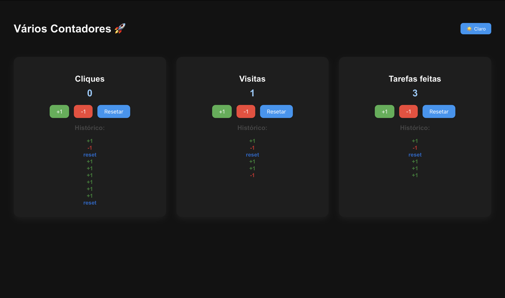

# 🚀 Projeto Contadores com Dark Mode

Este é um projeto de estudo em **React + TypeScript**, onde implementei:

✅ Contadores independentes  
✅ Histórico de ações (+1, -1, Reset)  
✅ Salvamento de estado no **localStorage**  
✅ Botões animados e coloridos  
✅ **Dark Mode 🌙☀️** com toggle  

---

## 📸 Preview




---

## 🛠️ Tecnologias usadas
- React
- TypeScript
- CSS

---

## ▶️ Como rodar o projeto

Clone o repositório e instale as dependências:

```bash
git clone https://github.com/seu-usuario/seu-repo.git
cd seu-repo
npm install
npm start
